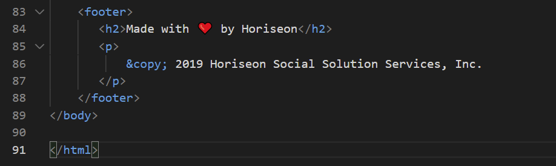

#  Week 1 HomeWork

## Assignment Details
* Our first homework assignment is to help a company improve their HTML and CSS so it follows accessibility standards. The webpage should not actually change but the code needs to have semantic elements that provide a more logical flow to the code. We also need to create a GitHub repository for the assignment, git add . changes as we alter the code and create a GitHub page with a link to the website. It is Due April 3 at 11:59pm.

## Planning an Approach
1. First I decided it was best to see how the webpage looked with the current HTML and CSS. I noticed that one link was not working, but otherise there weren't any bugs that I could see. It didn't make sense to necessarily try to fix the broken link in the HTML until I understood what I was dealing with.

2. Next I decided to look over the layout of the HTML. When I noticed that the main element used to divide the sections of the webpage was 'div' and that all had their own classes, 'div class="lots-of-classes"', that the CSS selectors were going to be more complicated than they needed to be.

3. Lastly I looked over the CSS. I thought about jumping in and changing the 
 elements, but that wouldn't make sense until I knew what the CSS selectors were and what the layout was like. I knew that other than the naming of the selectors, not much else was going to change in the CSS code. Yes, there would be redundant classes and lots of consolidating, but because the website page wasn't changing, neither would the code for font-size, background-color, margin, etc for the most part.

## Approach Style
I took the webpage by section and decided to start writing each section from scratch. I had the current HTML on one screen and my new HTML on another so I wouldn't get off track. starting inside at the 'h1' and 'p' and building it out. I did the CSS slightly different. I copied the exact original CSS into my new style sheet, but only had the specific section that i was working on as active and visible. So everytime I renamed a section to a semantic element such as 'main' or 'aside' I would update that selector in my CSS but not change any other part of the code.

## Changes by section blocks

### 1. Header section (from div)
There was no need to change anything about the first few lines of code before the "header" section.
The first big changes made were to improve the semantics of the top portion of the webpage which includes the name of the company/title of the website "Horiseon" and the clickable links.

 I decided to get rid of the first 'div' block element that contained the entire top portion of the website and instead put 'header'. By doing this I no longer need a class called '.header' I can just reference the ''header' element in the CSS.

I kept the 'h1' brakets around the title "Horiseon" because that clearly defines what it is, the first header line of the website. In the CSS is changed the ".header h1" to just "h1" because we no longer need to use the ".header" class.

The letters "seo" within the Horiseon title are a different color. Because this is so unique it made sense to change the HTML coding. The original coding 'span class="seo">seo< span' and it seemed like it should be an id instead so I changed it to 'span id="seo">seo< span'. The css then went from ".header h1 .seo" within CSS to just "#seo" to  designate that those letters need to be grey while the rest of the word is white. I kept the span because even though someone might not know the semantics, it is used within text to specify a difference in code and makes the most sense.

It seemed logical to change the next 'div' block located within the header that contains the clickable links to 'nav' since it is in fact the webpage's navagation bar. I did not see a reason to change the 'ul' and 'li'.
 Now I can change a couple more things in CSS. 
 * ".header div" became "nav" which designates the padding, margin, float, font-family and font-size of all the listed links.
 * ".header div ul" to "ul". In this code the list-style-type: none so there are no longer bullet points.
 * I changed ".header div ul li" to "li" which makes the display:inline-block and margin-left:25px.
 * finally i combined the "ul" and the "li" under "li"

I did not feel the need to change 'a' elements. And This is not there location of the broken link bug.
Here is the new header block html:

### 2. Aside section (from div)  
I am working on the body of the website, skipping over the image of the meeting below the header/navigation bar.
First I kept the current HTML but I made sure that the link for "search engine optimization" would work. this div section only has a class of "search-engine-optimization" and not an id with the same name where as the other two clickable links do, so I created the id="search-engine-optimization" that was missing.

The first 

 for the left section of the page containing the link images and info i changed to <main></main>. i took out the 
 because now I can just use the Selector "main" in CSS
Then for each 

 that created the three sections that contained the 3 link pics, title and details i called <section><section>. Within the <section> element I kept the unique id="" tags that connected the link from the navigation bar. 
In the original CSS all of the now <sections> had individual classes, that went to separate Selectors in CSS which all had the same CSS code. So I gave all the sections the same class <section class="link-info"> to significantly reduce the line of CSS code. I didn't change any of the CSS code, just now instead of 3 different selectors in CSS giving the same information I have one selector called .link-info providing the: margin-bottom, padding, height, font-family, background-color, and color(font) for all 3 sections.
Within each section is an "img" with a link to an image on file and a class specifying whether the image will "float-left" or "float-right". The first and last section img's float left and the second image floats right. The original CSS has ".float-left" twice with the same  "float:left;" and "margin-right: 25px;" perameters. I kept the class names the same in the HTML and CSS but removed the second and redundant float-left selector in the CSS.
the images (img) for all of the sections also have the same information in CSS but under 3 different selectors. I combined them all into the ".link info img" selector since they all had the same padding, clear, font-family, and text-align perameters.

THe section that is located on the right side of the webpage i changed its main 

 element to <aside></aside>. i got rid of the class "benefits" and just used asie as the selector in CSS.

very similar to the <main></main> the <aside></aside> has redundant "class" tags in HTML and additional Selectors in CSS.
I renamed all of the divs to <section></section> again to show the 3 sections of the aside with their individual images, text and titles. Each section has the same class of "side-info" which was then put into CSS and took the old "benefit.___" class which were 3 different names with all the same CSS and reduced it to one ".side-info" selector.
Samething with the headers, there were 3 different "h3" selectors put in with the same information so I shortened it to just h3 and it applied to all "h3"s used.
same thing with the images reduced it from 3 selectors to 1, because i'd already give all of their selectors the same class so ".info-side img" worked for all of them.

For the footer I didn't feel the need to change much too much, just mainly the semantics.

the 
 just became <footer>. The CSS changed from ".footer" to "footer. the header just changed from ".footer h2" to "footer h2"

Here is a screen shot of the company's website

